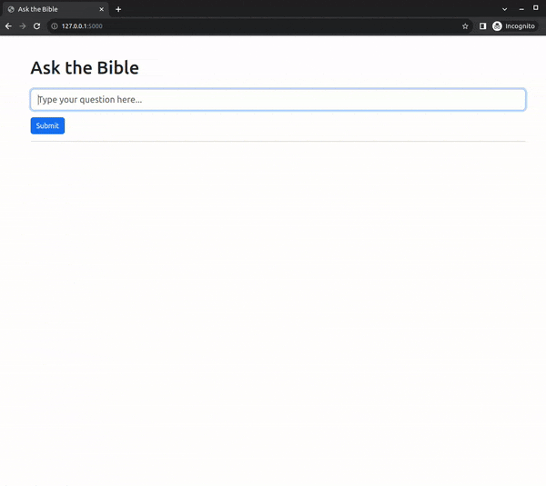

# talking_text
The aim of the project is to provide an educational tool that allows questions to be asked of religious texts.

The project seeks to apply functions from the langchain library.

## Usage

Can be run via docker-compose or venv.

### Docker Compose
Run the docker-compose project to launch the webserver. The webserver will be available at http://localhost:5000.
```bash
docker-compose up --build -d
```
(or `sudo docker-compose up --build -d` if you need root permissions to access the GPU.)

### Venv
Create a virtual environment and install the requirements.
```bash
python3 -m venv venv
source venv/bin/activate
pip install -r requirements_slow.txt
pip install -r requirements_quick.txt
```
The requirements are split across two files to help the caching of the big pytorch download.

### Example


## How it Works?

### Overview

This project is a Question-Answering (QA) system that leverages the Langchain library and a Flask web interface. Users can ask questions related to Bible passages, and the system will provide relevant answers and source documents.

### Components

1. **Langchain Library**: Handles text embeddings, vector storage, and question retrieval. It uses HuggingFace for embeddings, FAISS for storing vectors, and OpenAI for the chat model.
2. **Flask Web Interface**: A simple web application where users can input their questions and view the answers along with the source documents.

### Flow

1. **Initialization**: 
   - The Langchain library initializes models and loads the New Heart English Bible (NHEB) dataset from a CSV file.
   - Text embeddings are stored in a FAISS vector store.
  
2. **User Interaction**:
   - Users enter their questions in a text box on the Flask web interface.
  
3. **Query Processing**: 
   - The Flask app sends the user's question to Langchain.
   - Langchain uses the vector store to retrieve relevant Bible passages and the OpenAI model to generate an answer.
  
4. **Display Results**: 
   - The answer and source documents are displayed on the web interface.
   - Source documents are shown as blockquotes, with the verse serving as the citation.

5. **Styling**: 
   - The web interface is styled using Bootstrap and custom CSS for better user experience.

# Sources

Bible passages are from the New Heart English Bible (NHEB), which can be found here - https://nheb.net/

Quran passages are from the Quran JSON project collated by Risan Bagja Pradana - https://github.com/risan/quran-json

## Quran Preprocessing

The Quran JSON file is ordered by chapters and verses.